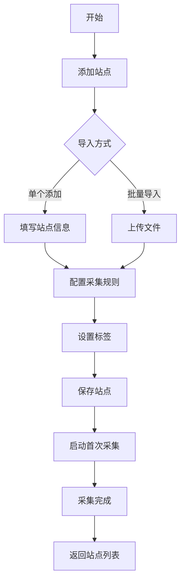
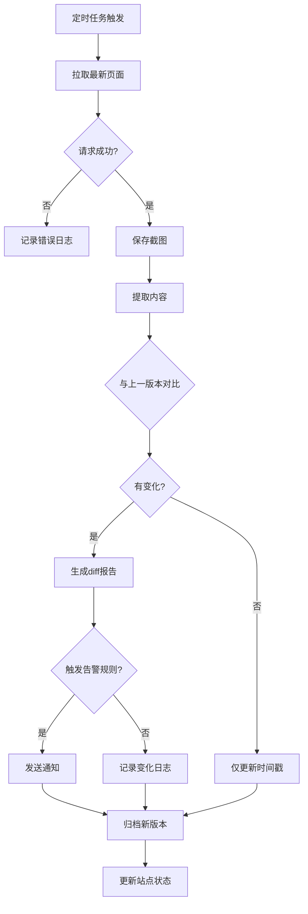
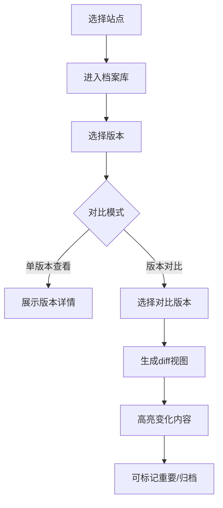

# 网站档案馆 - 产品需求文档

## 1. 产品概述

网站档案馆是一款专注于网站变化追踪的自动化监控工具。通过定期巡检用户关注的网站，完整记录页面内容、截图和元数据变化，为用户提供可追溯的网站历史档案。适用于竞品监控、内容变更追踪、网页快照保存等场景。

**核心价值**：不遗漏任何重要变化，保留完整历史版本，支持多维度对比分析。

**目标用户**：内容运营人员、产品经理、市场分析师、技术运维人员等需要持续关注网站内容变化的群体。

---

## 2. 核心功能

### 2.1 站点清单

网站管理的基础模块，负责维护所有被监控站点的信息。

**功能详情**：
- 添加单个网址（支持自定义名称、描述）
- 批量导入站点（支持 CSV/JSON 格式）
- 编辑站点基本信息
- 删除站点（可选是否保留历史数据）
- 站点状态总览（正常/异常/暂停）
- 按标签分组管理
- 搜索和筛选站点
- 暂停/恢复监控任务

**站点信息字段**：
- URL 地址
- 自定义名称
- 描述备注
- 所属标签
- 采集频率
- 创建时间
- 最后采集时间
- 当前状态

### 2.2 采集规则

定义每个站点的具体采集策略和参数配置。

**功能详情**：
- 设置采集频率（每小时/每天/每周/自定义 cron 表达式）
- 指定页面范围（整站/指定路径/正则匹配）
- 选择采集内容（仅标题/标题+摘要/完整正文/完整 HTML）
- 截图配置（启用/禁用、截图区域、全屏/视口）
- 超时设置
- 重试策略
- 代理配置（可选）
- 请求头自定义
- 增量采集 vs 全量采集

### 2.3 截图任务

负责网页截图的采集、存储和管理。

**功能详情**：
- 整页截图（捕获整个可滚动页面）
- 视口截图（当前可视区域）
- 自定义区域截图
- 高清截图（2x 分辨率）
- 截图格式选择（PNG/JPEG/WebP）
- 截图历史查看
- 截图对比（视觉diff）
- 截图预览和下载
- 批量截图任务

**技术特性**：
- 支持延迟截图（等待动态内容加载）
- 自动处理懒加载图片
- 处理反爬虫机制

### 2.4 差异查看

变化检测和对比分析的核心模块。

**功能详情**：
- 标题变化检测
- 正文内容 diff（词语级别高亮）
- HTML 结构变化分析
- CSS/样式变化检测
- 图片变化对比
- 链接变化追踪（新增/删除链接）
- 元数据变化（meta keywords, description 等）
- 变化时间线展示
- 变化严重程度评估
- 变化原因推测

**Diff 展示**：
- 侧边对比视图
- 行内差异高亮
- 颜色编码（新增绿色、删除红色、修改黄色）
- 版本跳转对比

### 2.5 告警中心

变化通知和重要更新标记系统。

**功能详情**：
- 重要更新标记（手动标记/自动规则）
- 告警规则配置（变化阈值、关键词监控）
- 告警级别设置（信息/警告/紧急）
- 告警历史记录
- 告警订阅管理
- 已处理/未处理状态切换
- 告警聚合（避免告警风暴）
- 告警统计报表

**通知渠道**：
- 系统内通知
- 邮件通知（SMTP 配置）
- Webhook 回调
- 浏览器推送（可选）

### 2.6 档案库

历史版本的存储和检索系统。

**功能详情**：
- 版本时间轴浏览
- 完整历史版本查看
- 版本对比（任意两个版本）
- 版本快照导出
- 版本备注和标签
- 版本归档（标记为重要/已归档）
- 历史版本搜索
- 按时间范围筛选
- 按内容关键词搜索
- 版本收藏

**存储策略**：
- 自动清理过期版本（保留最近 N 个版本）
- 重要版本永久保存
- 压缩存储优化空间

### 2.7 运行日志

系统运行状态和任务执行记录。

**功能详情**：
- 实时任务执行日志
- 历史日志查询
- 日志级别过滤（INFO/WARN/ERROR）
- 日志导出
- 任务耗时统计
- 成功率统计
- 异常错误追踪
- 日志搜索和筛选
- 系统健康状态监控

---

## 3. 其他功能

### 3.1 数据管理
- 批量导入站点（CSV/JSON）
- 批量导出巡检结果
- 数据备份和恢复
- 存储空间管理

### 3.2 报告生成
- 月度摘要报告（变化统计、趋势分析）
- 自定义报告模板
- 报告导出（PDF/HTML）

### 3.3 高级功能
- 标签管理（创建/编辑/删除标签）
- 站点分组
- 收藏夹
- 回收站（误删恢复）

---

## 4. 核心流程

### 4.1 站点添加流程

### 4.2 变化检测流程

### 4.3 版本对比流程

---

## 5. 用户界面设计

### 5.1 设计风格

**整体定位**：专业、高效、可信赖的企业级工具风格，兼具现代感和实用性。

**视觉特征**：
- 简洁清晰的界面层次
- 卡片式布局展示信息
- 充足的留白和呼吸感
- 微妙的阴影和层次感
- 数据可视化图表
- 响应式动画反馈

**色彩方案**：
- 主色调：深蓝色 (#1e3a5f) - 专业稳重
- 辅助色：天蓝色 (#3b82f6) - 活力现代
- 强调色：琥珀色 (#f59e0b) - 告警提示
- 成功色：翠绿色 (#10b981) - 成功状态
- 危险色：红色 (#ef4444) - 错误告警
- 背景色：浅灰 (#f8fafc) - 页面底色
- 卡片色：白色 (#ffffff) - 卡片背景
- 文字色：深灰 (#1f2937) - 正文
- 次要文字：灰色 (#6b7280) - 辅助说明

**字体选择**：
- 标题：Source Han Sans SC (思源黑体) / Noto Sans SC
- 正文：Inter / Roboto
- 代码/数据：JetBrains Mono / Fira Code

**布局方案**：
- 左侧固定导航栏（可折叠）
- 顶部工具栏（搜索、通知、用户）
- 主内容区域（卡片网格布局）
- 右侧信息面板（详情/对比视图）

**图标风格**：
- Lucide Icons（线性图标）
- 统一 24px 尺寸
- 与文字对齐

### 5.2 页面设计

#### 5.2.1 仪表盘（首页）
- 站点统计概览卡片（总数/活跃/暂停）
- 变化趋势图表
- 最近告警列表
- 快速操作入口
- 存储使用情况

#### 5.2.2 站点清单页面
- 站点列表表格（可排序/筛选）
- 标签过滤器
- 搜索框
- 批量操作工具栏
- 卡片/列表视图切换
- 分页控件

#### 5.2.3 站点详情页面
- 基本信息卡片
- 采集规则配置
- 实时状态指示
- 最近采集预览
- 历史版本入口
- 操作日志

#### 5.2.4 档案库页面
- 版本时间轴
- 版本卡片列表
- 版本对比工具
- 搜索和筛选
- 批量归档

#### 5.2.5 告警中心页面
- 告警统计卡片
- 告警列表（按级别着色）
- 告警详情面板
- 告警规则配置
- 订阅管理

#### 5.2.6 日志页面
- 日志统计
- 实时日志流
- 日志搜索
- 日志导出

### 5.3 响应式设计
- 桌面优先设计
- 平板适配（导航折叠）
- 移动端简化视图
- 触摸友好交互

---

## 6. 页面结构总览

| 页面名称 | 主要模块 | 核心交互 |
|---------|---------|---------|
| 仪表盘 | 统计卡片、趋势图、最近告警 | 数据刷新、图表交互 |
| 站点清单 | 站点列表、标签栏、搜索 | CRUD操作、批量处理 |
| 站点详情 | 信息卡片、规则配置、历史 | 表单提交、版本对比 |
| 采集规则 | 规则表单、频率设置 | 表单验证、保存 |
| 截图任务 | 截图列表、预览、对比 | 放大缩小、下载 |
| 差异查看 | Diff视图、版本选择 | 滑动对比、版本跳转 |
| 告警中心 | 告警列表、规则配置 | 标记处理、规则编辑 |
| 档案库 | 版本时间轴、搜索 | 筛选排序、批量归档 |
| 运行日志 | 日志流、统计分析 | 搜索过滤、导出 |
| 设置页面 | 通知配置、存储管理 | 表单提交 |

---

## 7. 错误处理和边界情况

### 7.1 网络异常
- 请求超时：显示错误状态，提供重试按钮
- 连接失败：记录错误，提供诊断信息
- 部分失败：记录失败的资源，继续处理

### 7.2 数据异常
- 页面结构变化：记录解析错误，提示用户
- 内容为空：区分正常空内容和采集失败
- 编码问题：自动检测编码，UTF-8 优先

### 7.3 存储异常
- 存储空间不足：警告用户，提示清理
- 数据库错误：记录错误，重试机制
- 文件损坏：检测并提示修复

### 7.4 性能优化
- 大量数据分页加载
- 懒加载历史版本
- 图片压缩存储
- 增量更新 diff
