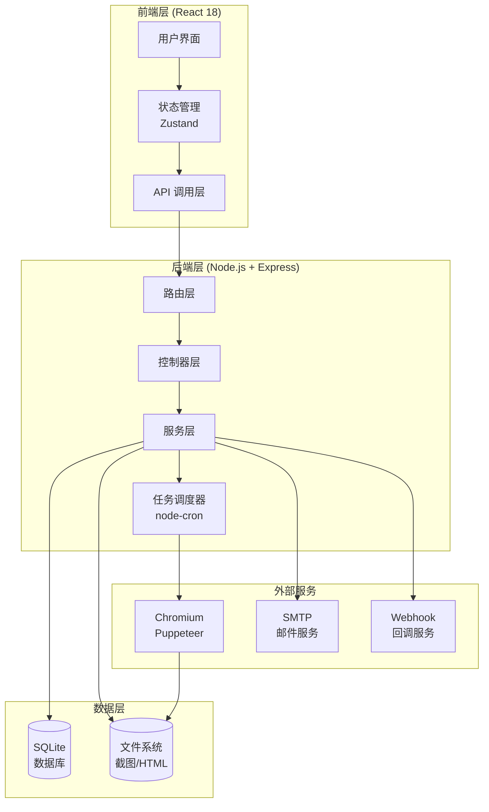
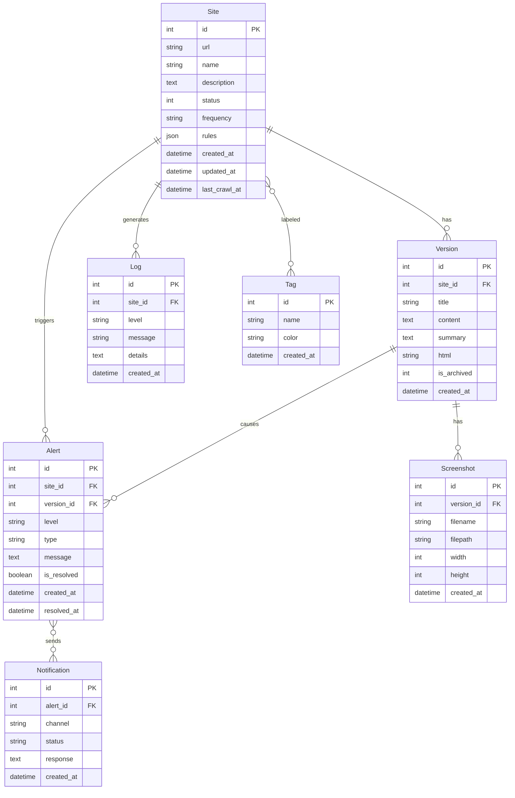
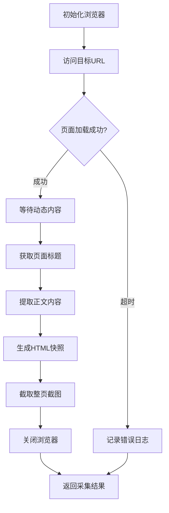

# 网站档案馆 - 技术架构文档

## 1. 架构设计

### 1.1 系统架构图



### 1.2 技术栈总览

**前端技术**：
- React 18.2 - UI 框架
- Vite 5 - 构建工具
- TypeScript 5 - 类型系统
- Tailwind CSS 3 - 样式框架
- Zustand - 状态管理
- React Router 6 - 路由管理
- React Query - 数据请求
- Lucide React - 图标库
- Recharts - 图表可视化
- Diff2Html - 差异展示

**后端技术**：
- Node.js 20 LTS - 运行时
- Express 4 - Web 框架
- better-sqlite3 - SQLite 数据库
- Puppeteer 22 - 无头浏览器
- node-cron - 任务调度
- cheerio - HTML 解析
- diff - 文本差异算法
- nodemailer - 邮件发送
- multer - 文件上传
- sharp - 图片处理

**开发工具**：
- TypeScript - 开发语言
- ESLint - 代码检查
- Prettier - 代码格式化
- concurrently - 并行运行

## 2. 项目结构

```
website-archive/
├── frontend/                 # 前端项目
│   ├── src/
│   │   ├── components/       # 组件
│   │   │   ├── layout/      # 布局组件
│   │   │   ├── common/      # 通用组件
│   │   │   ├── sites/       # 站点相关
│   │   │   ├── archive/     # 档案库相关
│   │   │   ├── alerts/       # 告警相关
│   │   │   └── logs/        # 日志相关
│   │   ├── pages/           # 页面
│   │   ├── hooks/           # 自定义 hooks
│   │   ├── stores/          # 状态管理
│   │   ├── services/        # API 服务
│   │   ├── types/           # TypeScript 类型
│   │   ├── utils/           # 工具函数
│   │   └── styles/          # 全局样式
│   ├── public/
│   ├── index.html
│   ├── package.json
│   ├── vite.config.ts
│   └── tailwind.config.js
│
├── backend/                  # 后端项目
│   ├── src/
│   │   ├── controllers/     # 控制器
│   │   ├── services/        # 服务层
│   │   ├── models/          # 数据模型
│   │   ├── routes/          # 路由
│   │   ├── middlewares/     # 中间件
│   │   ├── schedulers/      # 调度任务
│   │   ├── crawlers/        # 爬虫模块
│   │   ├── utils/           # 工具函数
│   │   ├── types/           # 类型定义
│   │   └── index.ts         # 入口文件
│   ├── data/                # 数据存储
│   │   ├── database.sqlite  # SQLite 数据库
│   │   ├── screenshots/     # 截图存储
│   │   └── archives/         # 归档存储
│   ├── package.json
│   └── tsconfig.json
│
├── package.json             # 根目录 workspace
└── README.md
```

## 3. 路由定义

### 3.1 前端路由

| 路由路径 | 页面名称 | 功能描述 |
|---------|---------|---------|
| `/` | 仪表盘 | 首页统计概览 |
| `/sites` | 站点清单 | 站点列表管理 |
| `/sites/new` | 添加站点 | 新建站点表单 |
| `/sites/:id` | 站点详情 | 站点详情和配置 |
| `/sites/:id/edit` | 编辑站点 | 编辑站点信息 |
| `/sites/:id/snapshots` | 截图管理 | 查看和管理截图 |
| `/archives` | 档案库 | 历史版本库 |
| `/archives/:siteId` | 站点档案 | 特定站点的档案 |
| `/archives/:siteId/compare` | 版本对比 | 版本对比工具 |
| `/alerts` | 告警中心 | 告警列表和管理 |
| `/alerts/rules` | 告警规则 | 告警规则配置 |
| `/logs` | 运行日志 | 系统日志查看 |
| `/settings` | 设置 | 系统设置 |
| `/settings/notifications` | 通知设置 | 通知渠道配置 |
| `/settings/storage` | 存储管理 | 存储空间管理 |

### 3.2 后端 API

#### 站点管理 API

| 方法 | 路径 | 描述 |
|-----|------|------|
| GET | `/api/sites` | 获取站点列表 |
| POST | `/api/sites` | 创建新站点 |
| GET | `/api/sites/:id` | 获取站点详情 |
| PUT | `/api/sites/:id` | 更新站点信息 |
| DELETE | `/api/sites/:id` | 删除站点 |
| POST | `/api/sites/:id/pause` | 暂停站点监控 |
| POST | `/api/sites/:id/resume` | 恢复站点监控 |
| POST | `/api/sites/:id/crawl` | 手动触发采集 |
| POST | `/api/sites/import` | 批量导入站点 |
| GET | `/api/sites/export` | 导出站点数据 |

#### 采集规则 API

| 方法 | 路径 | 描述 |
|-----|------|------|
| GET | `/api/sites/:id/rules` | 获取站点采集规则 |
| PUT | `/api/sites/:id/rules` | 更新采集规则 |

#### 版本管理 API

| 方法 | 路径 | 描述 |
|-----|------|------|
| GET | `/api/versions` | 获取版本列表 |
| GET | `/api/versions/:id` | 获取版本详情 |
| GET | `/api/versions/:id/content` | 获取版本内容 |
| GET | `/api/versions/:id/screenshot` | 获取版本截图 |
| DELETE | `/api/versions/:id` | 删除版本 |
| POST | `/api/versions/:id/archive` | 归档版本 |
| POST | `/api/versions/compare` | 对比两个版本 |
| GET | `/api/sites/:siteId/versions` | 获取站点的所有版本 |

#### 告警管理 API

| 方法 | 路径 | 描述 |
|-----|------|------|
| GET | `/api/alerts` | 获取告警列表 |
| PUT | `/api/alerts/:id` | 更新告警状态 |
| DELETE | `/api/alerts/:id` | 删除告警 |
| GET | `/api/alerts/rules` | 获取告警规则 |
| PUT | `/api/alerts/rules` | 更新告警规则 |
| POST | `/api/alerts/:id/resolve` | 标记告警已处理 |

#### 日志 API

| 方法 | 路径 | 描述 |
|-----|------|------|
| GET | `/api/logs` | 获取日志列表 |
| GET | `/api/logs/stats` | 获取日志统计 |
| GET | `/api/logs/export` | 导出日志 |

#### 截图 API

| 方法 | 路径 | 描述 |
|-----|------|------|
| GET | `/api/screenshots` | 获取截图列表 |
| GET | `/api/screenshots/:id` | 获取截图详情 |
| GET | `/api/screenshots/:id/image` | 获取截图图片 |
| DELETE | `/api/screenshots/:id` | 删除截图 |
| POST | `/api/screenshots/:id/compare` | 对比截图 |

#### 标签管理 API

| 方法 | 路径 | 描述 |
|-----|------|------|
| GET | `/api/tags` | 获取标签列表 |
| POST | `/api/tags` | 创建标签 |
| PUT | `/api/tags/:id` | 更新标签 |
| DELETE | `/api/tags/:id` | 删除标签 |

#### 统计 API

| 方法 | 路径 | 描述 |
|-----|------|------|
| GET | `/api/stats/dashboard` | 仪表盘统计数据 |
| GET | `/api/stats/monthly` | 月度统计报告 |

## 4. 数据模型

### 4.1 数据库 ER 图



### 4.2 数据表定义

#### sites 表

```sql
CREATE TABLE sites (
    id INTEGER PRIMARY KEY AUTOINCREMENT,
    url TEXT NOT NULL UNIQUE,
    name TEXT NOT NULL,
    description TEXT,
    status INTEGER DEFAULT 1,
    frequency TEXT DEFAULT 'daily',
    rules TEXT DEFAULT '{}',
    created_at DATETIME DEFAULT CURRENT_TIMESTAMP,
    updated_at DATETIME DEFAULT CURRENT_TIMESTAMP,
    last_crawl_at DATETIME,
    pause_reason TEXT
);

CREATE INDEX idx_sites_status ON sites(status);
CREATE INDEX idx_sites_created_at ON sites(created_at);
```

#### versions 表

```sql
CREATE TABLE versions (
    id INTEGER PRIMARY KEY AUTOINCREMENT,
    site_id INTEGER NOT NULL,
    title TEXT,
    content TEXT,
    summary TEXT,
    html TEXT,
    is_archived INTEGER DEFAULT 0,
    created_at DATETIME DEFAULT CURRENT_TIMESTAMP,
    FOREIGN KEY (site_id) REFERENCES sites(id) ON DELETE CASCADE
);

CREATE INDEX idx_versions_site_id ON versions(site_id);
CREATE INDEX idx_versions_created_at ON versions(created_at);
CREATE INDEX idx_versions_archived ON versions(is_archived);
```

#### screenshots 表

```sql
CREATE TABLE screenshots (
    id INTEGER PRIMARY KEY AUTOINCREMENT,
    version_id INTEGER NOT NULL,
    filename TEXT NOT NULL,
    filepath TEXT NOT NULL,
    width INTEGER,
    height INTEGER,
    file_size INTEGER,
    created_at DATETIME DEFAULT CURRENT_TIMESTAMP,
    FOREIGN KEY (version_id) REFERENCES versions(id) ON DELETE CASCADE
);

CREATE INDEX idx_screenshots_version_id ON screenshots(version_id);
```

#### alerts 表

```sql
CREATE TABLE alerts (
    id INTEGER PRIMARY KEY AUTOINCREMENT,
    site_id INTEGER NOT NULL,
    version_id INTEGER,
    level TEXT NOT NULL,
    type TEXT NOT NULL,
    message TEXT,
    details TEXT,
    is_resolved INTEGER DEFAULT 0,
    created_at DATETIME DEFAULT CURRENT_TIMESTAMP,
    resolved_at DATETIME,
    FOREIGN KEY (site_id) REFERENCES sites(id) ON DELETE CASCADE,
    FOREIGN KEY (version_id) REFERENCES versions(id) ON DELETE SET NULL
);

CREATE INDEX idx_alerts_site_id ON alerts(site_id);
CREATE INDEX idx_alerts_level ON alerts(level);
CREATE INDEX idx_alerts_resolved ON alerts(is_resolved);
CREATE INDEX idx_alerts_created_at ON alerts(created_at);
```

#### logs 表

```sql
CREATE TABLE logs (
    id INTEGER PRIMARY KEY AUTOINCREMENT,
    site_id INTEGER,
    level TEXT NOT NULL,
    message TEXT NOT NULL,
    details TEXT,
    created_at DATETIME DEFAULT CURRENT_TIMESTAMP,
    FOREIGN KEY (site_id) REFERENCES sites(id) ON DELETE SET NULL
);

CREATE INDEX idx_logs_site_id ON logs(site_id);
CREATE INDEX idx_logs_level ON logs(level);
CREATE INDEX idx_logs_created_at ON logs(created_at);
```

#### tags 表

```sql
CREATE TABLE tags (
    id INTEGER PRIMARY KEY AUTOINCREMENT,
    name TEXT NOT NULL UNIQUE,
    color TEXT DEFAULT '#3b82f6',
    created_at DATETIME DEFAULT CURRENT_TIMESTAMP
);
```

#### site_tags 表（多对多关系）

```sql
CREATE TABLE site_tags (
    site_id INTEGER NOT NULL,
    tag_id INTEGER NOT NULL,
    PRIMARY KEY (site_id, tag_id),
    FOREIGN KEY (site_id) REFERENCES sites(id) ON DELETE CASCADE,
    FOREIGN KEY (tag_id) REFERENCES tags(id) ON DELETE CASCADE
);
```

## 5. API 接口详细设计

### 5.1 站点相关接口

#### POST /api/sites
创建新站点

**请求体**：
```typescript
interface CreateSiteRequest {
    url: string;
    name: string;
    description?: string;
    frequency?: string;
    rules?: CrawlRules;
    tags?: number[];
}
```

**响应**：
```typescript
interface SiteResponse {
    id: number;
    url: string;
    name: string;
    description: string | null;
    status: 'active' | 'paused' | 'error';
    frequency: string;
    rules: CrawlRules;
    tags: Tag[];
    created_at: string;
    updated_at: string;
    last_crawl_at: string | null;
}
```

#### GET /api/sites
获取站点列表

**查询参数**：
```typescript
interface ListSitesQuery {
    page?: number;
    pageSize?: number;
    status?: 'active' | 'paused' | 'error';
    tagId?: number;
    search?: string;
    sortBy?: 'name' | 'created_at' | 'last_crawl_at';
    sortOrder?: 'asc' | 'desc';
}
```

**响应**：
```typescript
interface ListSitesResponse {
    data: SiteResponse[];
    pagination: {
        total: number;
        page: number;
        pageSize: number;
        totalPages: number;
    };
}
```

### 5.2 版本对比接口

#### POST /api/versions/compare
对比两个版本

**请求体**：
```typescript
interface CompareVersionsRequest {
    versionId1: number;
    versionId2: number;
}
```

**响应**：
```typescript
interface CompareVersionsResponse {
    version1: VersionInfo;
    version2: VersionInfo;
    diff: {
        title?: DiffResult;
        content?: DiffResult;
        added: number;
        removed: number;
        changed: number;
    };
}
```

### 5.3 告警相关接口

#### GET /api/alerts
获取告警列表

**查询参数**：
```typescript
interface ListAlertsQuery {
    page?: number;
    pageSize?: number;
    level?: 'info' | 'warning' | 'critical';
    isResolved?: boolean;
    siteId?: number;
    startDate?: string;
    endDate?: string;
}
```

## 6. 核心模块设计

### 6.1 爬虫模块 (Crawler)

**职责**：使用 Puppeteer 抓取网页内容

**核心流程**：


**关键方法**：
- `initBrowser()`: 初始化无头浏览器实例
- `crawl(url, options)`: 执行页面抓取
- `takeScreenshot(page)`: 截图
- `extractContent(page)`: 提取正文
- `cleanup()`: 清理资源

### 6.2 任务调度器 (Scheduler)

**职责**：管理定时采集任务

**核心逻辑**：
- 使用 node-cron 实现 cron 表达式解析
- 维护任务队列
- 控制并发数量
- 失败重试机制
- 任务状态追踪

### 6.3 差异检测服务 (DiffService)

**职责**：检测页面变化并生成 diff

**核心方法**：
- `compareVersions(v1, v2)`: 对比两个版本
- `detectTitleChange(old, new)`: 检测标题变化
- `diffContent(old, new)`: 生成内容差异
- `calculateChangeScore(diff)`: 计算变化程度

### 6.4 告警服务 (AlertService)

**职责**：管理和发送告警通知

**核心流程**：
1. 版本变化触发检查
2. 评估变化是否满足告警规则
3. 创建告警记录
4. 通过配置的渠道发送通知
5. 记录通知状态

## 7. 存储策略

### 7.1 文件存储结构

```
backend/data/
├── database.sqlite          # 主数据库
├── screenshots/            # 截图存储
│   ├── {site_id}/
│   │   ├── {version_id}/
│   │   │   ├── full.png
│   │   │   └── thumbnail.png
│   │   └── ...
├── archives/               # 归档存储
│   ├── {site_id}/
│   │   ├── {version_id}/
│   │   │   ├── content.txt
│   │   │   └── metadata.json
│   │   └── ...
└── exports/                # 导出文件临时存储
```

### 7.2 数据保留策略

- **活跃版本**：保留最近 30 个版本
- **重要版本**：永久保留（用户标记）
- **截图**：与版本同步保留
- **告警**：保留 90 天
- **日志**：保留 60 天

## 8. 性能优化策略

### 8.1 前端优化
- 路由懒加载
- 组件按需渲染
- 图片懒加载
- 虚拟列表（长列表）
- 数据缓存（React Query）
- 防抖节流（搜索输入）

### 8.2 后端优化
- 数据库索引优化
- 分页查询
- 图片压缩存储
- HTML 内容压缩
- 增量对比（非全量对比）
- 异步任务队列

### 8.3 并发控制
- 浏览器实例池
- 任务并发数限制（默认 3）
- 资源使用监控

## 9. 错误处理机制

### 9.1 前端错误处理
- 全局错误边界组件
- API 错误拦截
- 友好的错误提示
- 重试机制

### 9.2 后端错误处理
- 统一错误响应格式
- 分层异常捕获
- 详细错误日志
- 优雅降级策略

## 10. 安全性考虑

### 10.1 输入验证
- URL 格式验证
- SQL 注入防护
- XSS 防护
- 文件类型验证

### 10.2 资源限制
- 请求超时限制
- 文件大小限制
- 爬虫深度限制
- 并发请求限制

### 10.3 数据安全
- 敏感信息加密存储
- 数据库备份
- 操作日志审计
